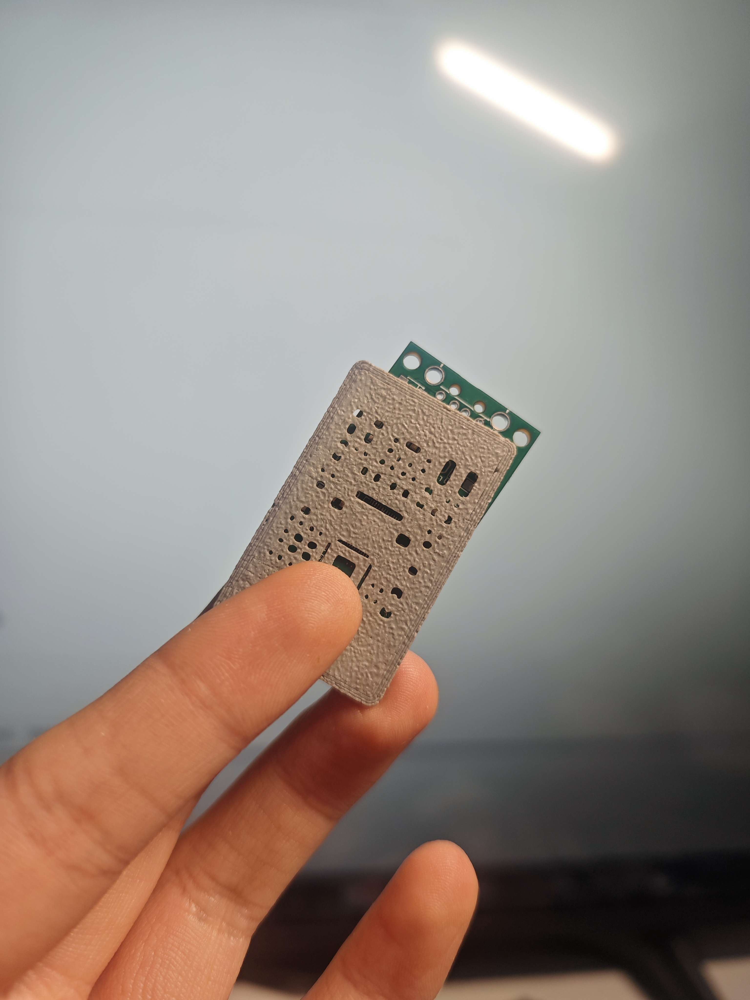
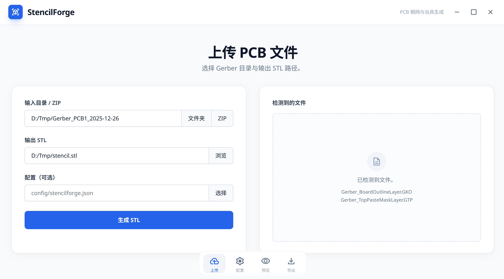
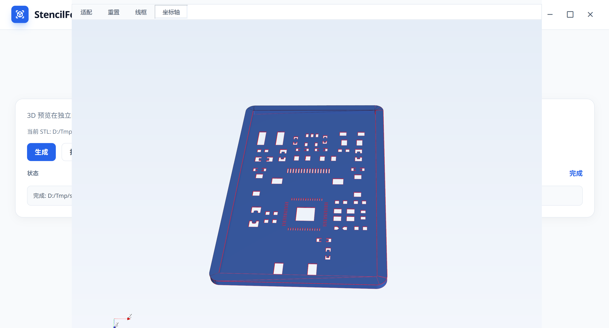

# StencilForge 🛠️

<p align="left">
  <a href="https://github.com/11cookies11/StencilForge">
    
  </a>
  <a href="https://github.com/11cookies11/StencilForge/blob/main/LICENSE">
    
  </a>
  <a href="https://github.com/11cookies11/StencilForge/stargazers">
    
  </a>
  <a href="https://github.com/11cookies11/StencilForge/issues">
    
  </a>
  <a href="https://github.com/11cookies11/StencilForge/releases">
    
  </a>
  
  
  
  
</p>

```text
+--------------------------------------------------+
|  StencilForge                                    |
|  PCB Stencil + Fixture Generator (Gerber -> STL) |
+--------------------------------------------------+
```

Language: English | [简体中文](README.zh-CN.md)

## Overview ✨

StencilForge converts Gerber + Excellon exports into 3D STL models for
PCB stencils and locator fixtures. It targets common EDA exports while
keeping the pipeline generic and configurable.

## Highlights 🚀

- Fast Gerber -> STL pipeline
- CadQuery or Trimesh backend
- Stencil cutouts with configurable offsets
- Locator structure: step or wall
- VTK preview window (no WebGL)

## Gallery 🖼️

**Printed stencil**


**UI main screen**


**STL preview**


## Quick start ⚡

1. Create a venv and install deps: `pip install -r requirements.txt`
2. Install the package: `pip install -e .`
3. Update `config/stencilforge.json` as needed
4. Run:

```bash
stencilforge <gerber_dir> <output_stl>
```

## UI (Vue + PySide6 + Qt WebEngine) 🧭

Build the UI:

```bash
cd ui-vue
npm install
npm run build
```

Launch the desktop UI:

```bash
stencilforge-ui
```

## Config parameters 🧰

- `paste_patterns`: paste layer file patterns (top paste default)
- `outline_patterns`: board outline patterns
- `thickness_mm`: stencil thickness
- `paste_offset_mm`: shrink/expand opening (negative shrinks)
- `outline_margin_mm`: fallback outline margin when no outline file exists
- `output_mode`: `holes_only` or `solid_with_cutouts`
- `model_backend`: `trimesh` or `cadquery`
- `locator_enabled`: enable locator structure
- `locator_mode`: `step` (recess) or `wall` (frame)
- `locator_height_mm`: wall height
- `locator_width_mm`: wall width
- `locator_clearance_mm`: clearance gap
- `locator_step_height_mm`: step height (PCB recess)
- `locator_step_width_mm`: step width (expands outward)
- `locator_open_side`: open side (`none/top/right/bottom/left`)
- `locator_open_width_mm`: open width
- `stl_linear_deflection`: STL linear deflection (mm, smaller = finer)
- `stl_angular_deflection`: STL angular deflection (radians)
- `arc_steps`: number of steps to approximate arcs
- `curve_resolution`: buffer resolution for circles
- `qfn_regen_enabled`: enable QFN paste regeneration
- `qfn_min_feature_mm`: minimum printable feature for FDM
- `qfn_confidence_threshold`: confidence threshold to modify apertures
- `qfn_max_pad_width_mm`: max pad width to consider as QFN pad

## Conventions (recommended) 📌

- Changelog: `CHANGELOG.md` (Keep a Changelog style)
- Commit messages & PR titles: Conventional Commits (e.g. `feat:`, `fix:`, `chore:`)
- Community docs: `CONTRIBUTING.md`, `SECURITY.md`, `CODE_OF_CONDUCT.md`
- Issue / PR templates: `.github/`

## License 📄

GPL-3.0-only. See `LICENSE`.
