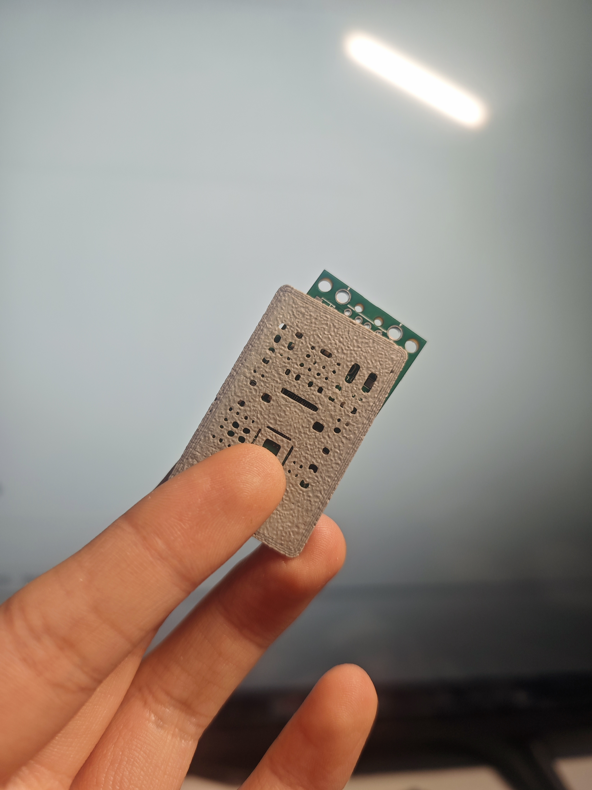
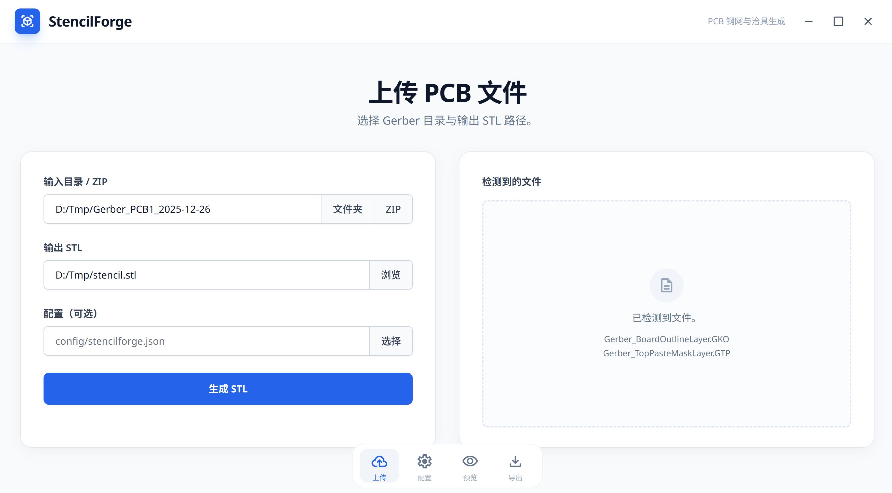
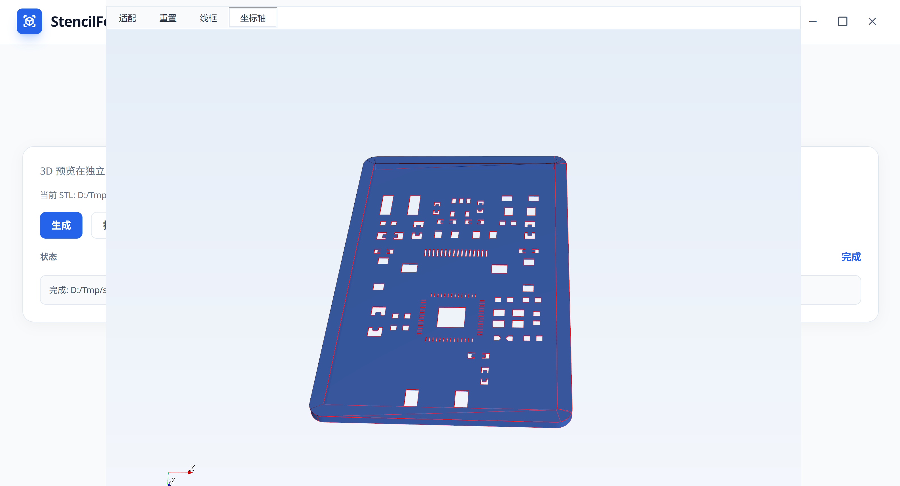

# StencilForge

<p align="left">
  <a href="https://github.com/11cookies11/StencilForge">
    
  </a>
  <a href="https://github.com/11cookies11/StencilForge/blob/main/LICENSE">
    
  </a>
  <a href="https://github.com/11cookies11/StencilForge/stargazers">
    
  </a>
  <a href="https://github.com/11cookies11/StencilForge/issues">
    
  </a>
  <a href="https://github.com/11cookies11/StencilForge/releases">
    
  </a>
  
  
  
  
</p>

<p align="center">
  
</p>

StencilForge is a desktop tool for generating PCB stencil STL models from Gerber inputs.

## Overview

StencilForge converts Gerber and Excellon exports into 3D STL models for PCB stencils and locator fixtures. It supports a desktop UI, configurable geometry processing, and both CadQuery and Trimesh backends.

## Highlights

- Fast Gerber to STL pipeline
- CadQuery or Trimesh backend
- Stencil cutouts with configurable offsets
- Locator structure: step or wall
- VTK preview window without WebGL

## Gallery

**Printed stencil**


**UI main screen**


**STL preview**


## Quick start

1. Create a virtual environment and install dependencies: `pip install -r requirements.txt`
2. Install the package: `pip install -e .`
3. Update `config/stencilforge.json` as needed
4. Run:

```bash
stencilforge <gerber_dir> <output_stl>
```

## UI

Build the UI:

```bash
cd ui-vue
npm install
npm run build
```

Launch the desktop UI:

```bash
stencilforge-ui
```

## Config parameters

- `paste_patterns`: paste layer file patterns
- `outline_patterns`: board outline layer patterns
- `thickness_mm`: stencil thickness
- `paste_offset_mm`: aperture offset, negative values shrink openings
- `outline_margin_mm`: fallback outline margin when no outline file exists
- `output_mode`: `holes_only` or `solid_with_cutouts`
- `model_backend`: `trimesh` or `cadquery`
- `locator_enabled`: enable the locator structure
- `locator_mode`: `step` or `wall`
- `locator_height_mm`: locator wall height
- `locator_width_mm`: locator wall width
- `locator_clearance_mm`: locator clearance gap
- `locator_step_height_mm`: locator step height
- `locator_step_width_mm`: locator step width
- `locator_open_side`: open side (`none/top/right/bottom/left`)
- `locator_open_width_mm`: open width
- `stl_linear_deflection`: STL linear deflection in mm
- `stl_angular_deflection`: STL angular deflection in radians
- `arc_steps`: number of arc approximation steps
- `curve_resolution`: circle buffer resolution
- `qfn_regen_enabled`: enable QFN aperture regeneration
- `qfn_min_feature_mm`: minimum printable feature size
- `qfn_confidence_threshold`: confidence threshold for QFN regeneration
- `qfn_max_pad_width_mm`: maximum pad width considered for QFN

## Conventions

- Changelog: `CHANGELOG.md`
- Commit messages and PR titles: Conventional Commits
- Community docs: `CONTRIBUTING.md`, `SECURITY.md`, `CODE_OF_CONDUCT.md`
- Issue and PR templates: `.github/`

## License

GPL-3.0-only. See `LICENSE`.
